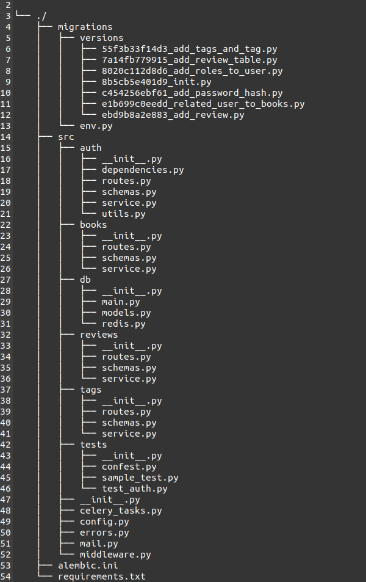

# Readify-Backend

## Technology Stack and Features

- ⚡ [**FastAPI**](https://fastapi.tiangolo.com) for the Python backend API.
    - 🧰 [SQLAlchemy](https://www.sqlalchemy.org/) for Python SQL Toolkit and Object Relational Mapper (ORM).
    - 🔍 [Pydantic](https://docs.pydantic.dev) for data validation and settings management.
    - 💾 [PostgreSQL](https://www.postgresql.org) as the SQL database.
    - ⛁ [Redis](https://redis.io/) for in-memory caching and as a message broker for Celery.
    - 🐍 [Celery](https://docs.celeryproject.org/en/stable/) for background processing and task management.
    - ⛃ [SQLElectron](https://sqlectron.github.io) - A simple and lightweight SQL client desktop/terminal with cross-database and platform support.
    - 👮‍♂️ [Postman](https://www.postman.com/) for API testing and management.
    - 🔁 [Alembic](https://alembic.sqlalchemy.org) as a lightweight database migration tool for SQLAlchemy.

- 🐋 [Docker Compose](https://www.docker.com) for development and production.
- 🔒 Secure password hashing by default.
- 🔑 JWT (JSON Web Token) authentication.
- 📫 Email-based password recovery and verification.
- 📧 **Email Authentication System**: Users must verify their email addresses upon registration. An email containing a verification link is sent to the user's registered email address. The user must click the link to activate their account before logging in.
- ✅ Tests with [Pytest](https://pytest.org).

## Middleware and CORS

- **Middleware**: Custom middleware is implemented for logging request and response details, helping to monitor the API's performance and usage.
- **CORS**: Cross-Origin Resource Sharing (CORS) is enabled to allow requests from various origins, ensuring that the API can be accessed from different client applications.

## Custom Error Handling

- A robust error handling mechanism is in place, providing meaningful error messages and status codes for various application-specific exceptions. This includes:
  - User-related errors (e.g., user already exists, user not found).
  - Token-related errors (e.g., invalid or revoked tokens).
  - Permission-related errors (e.g., insufficient permissions).
  - Resource-related errors (e.g., book or tag not found).

## Background Processing with Celery

### Overview
Celery is integrated into the Readify-Backend to handle asynchronous tasks and background processing. This allows the API to offload time-consuming operations, improving response times and overall user experience.

### Features
- **Asynchronous Task Queue**: Celery enables the execution of tasks in the background, freeing up the main thread to handle incoming requests.
- **Task Scheduling**: You can schedule tasks to run at specific intervals or times, making it ideal for repetitive jobs.
- **Redis as Broker**: Redis is used as the message broker, facilitating communication between the FastAPI app and Celery workers.

### Installation
To set up Celery, ensure you have Redis running and then install the necessary dependencies:
```bash
pip install celery[redis]
```

## Unit and Mock Testing

### Overview
Unit testing and mocking are essential for ensuring the reliability and correctness of your application. This project uses [Pytest](https://pytest.org) for testing.

### Setting Up Testing
1. **Install Dependencies**:
   Make sure you have the necessary testing libraries installed:
   ```bash
   pip install pytest pytest-mock
   ```

### Folder & file Directory

[](https://github.com/Sagor0078/Readify-Backend)


## Continue...